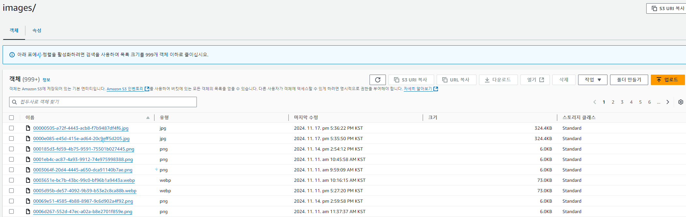

# 🎫 TICKET BLUE
_프로젝트 개요_

공연 등 다양한 문화 및 엔터테이먼트 이벤트의 티켓을 온라인으로 예매할 수 있는 서비스

# ⚽ Goals
_핵심 목표_

작성중

# 🌟 Key Summary
_핵심 요약_

작성중

# 🚀 Infra Architecture & STACK
_인프라 아키텍처 & 적용기술_

[ERD diagram](https://www.erdcloud.com/d/5iR9JboxDdHp9rhv4)

Development & Communication

Frameworks & Languages

Data & Monitoring

Deployment & Operations

API & Testing

# 🔍 Main Features
_주요 기능_

Admin
    
    - 관리자 전용 계정으로 가입할 수 있습니다.
    - 포스터 파일을 첨부하여 공연을 등록하고 수정 삭제가 가능합니다. - 이미지는 AWS S3에 저장됩니다.
    - 공연장, 출연자, 공연에 대한 회차등을 등록하고 관리할 수 있습니다.
    - 

Search

    작성중

Reservation

    작성중

# 🔥 Technical Enhancements
_기술적 고도화_

 
JIRA

### [Jira로 프로젝트 관리하기](https://everyday-spring.com/626)

- 프로젝트 관리 툴 Jira 도입
- Jira - GitHub 연동하기

 
SWAGGER

### [Java SpringBoot Swagger 적용하기](https://everyday-spring.com/625)

- Java SpringBoot Swagger 적용하기
- Swagger GET Method RequestBody
- Swagger Request Form

 
AWS S3 File Upload

- 공연 등록 시 공연 포스터 S3에 업로드 기능
- 공연 삭제 시 포스터 동시 삭제
- 포스터 수정 시 S3에 있던 기존 이미지가 삭제된 후 새로운 이미지로 교체 기능
- S3 이미지 첨부파일 올라간 모습

 
toss payments 결제 API 연동

위아래를 띄우고 여기에 내용을 작성하세요
마크다운 문법으로 작성하시면 됩니다

 
Jenkins CI/CD

### Window PC에 Docker, jenkins 설치, GitHub 연동하기

- [ (1) 난 대학시절 삽질을 전공했단 사실](https://everyday-spring.com/628)
- [ (2) 난 삽질로 유학까지 다녀왔단 사실](https://everyday-spring.com/629)

### AWS EC2에 Docker Jenkins 설치, Github Spring Boot application CI/CD

- [ (1) CI/CD를 위한 EC2 준비하기](https://everyday-spring.com/630)
- [ (2) EC2 Server 연결하기, ubuntu 메모리 스왑](https://everyday-spring.com/631)
- [ (3) Docker, Jenkins 설치 | Docker in Docker](https://subin0522.tistory.com/632)
- [ (4) Jenkins Pipeline CI/CD](https://subin0522.tistory.com/633)

### [EC2 ubuntu Jenkins CI/CD 트러블 슈팅](https://everyday-spring.com/634)

- Jenkins Spring Boot build 무한로딩
- Spring Boot Spotless Plugin build resource
- Docker not found
- 그런데 또 무한로딩이 걸림
- not in a git directory
- Jenkins CI/CD 환경변수

 
Redis - 동시성 제어

위아래를 띄우고 여기에 내용을 작성하세요
마크다운 문법으로 작성하시면 됩니다

 
Redis - Caching

- 배우 단건 조회 : 캐싱 전 Average 32, Error 0% → 캐싱 후 Average 7, Error 0%

- 공연 단건 조회 : 캐싱 전 Average 30, Error 0% → 캐싱 후 Average 14, Error 0%

- 공연 회차 조회 : 캐싱 전 Average 25, Error 0% → 캐싱 후 Average 12, Error 0%

- 공연 관람평 조회 : 캐싱 전 Average 17369, Error 0% → 캐싱 후 Average 19, Error 0%

- 공연 출연자 조회 : 캐싱 전 Average 26, Error 1.04% → 캐싱 후 Average 19, Error 0%

- 공연장 단건 조회 : 캐싱 전 Average 148, Error 9.55% → 캐싱 후 Average 12, Error 0%

 
Elasticsearch

### elastic 환경설정 및 검색 api구현과정
- https://velog.io/@uara67/Spring-ELK-1-엘라스틱-서치-그게-뭔데
- https://velog.io/@uara67/Spring-ELK-Docker-Elastic-Search-Kibana를-설치해서-springboot와-연결하자-1
- https://velog.io/@uara67/Spring-ELK-Docker-Elastic-Search-Kibana를-설치해서-springboot와-연결하자-2
- https://velog.io/@uara67/Spring-ELK-es로-구현한-예매검색-api
### elastic api 성능체크 및 grafna 이용한 모니터링
- https://velog.io/@uara67/Elastic-성능-체크를-promethus와-grafna로-해보자
- https://velog.io/@uara67/Elasticsearch-성능-테스트-보고서-1
- https://velog.io/@uara67/elastic-모니터링과-속도측정테스트-2
- 
  [성능테스트 결과 요약]
  - https://velog.io/@uara67/Elasticsearch-vs-MySQL-왜-MySQL이-더-빠를까
  - 
  
  

 
Alert - AOP

### AOP 를 사용하여 알림설정
- [ (1) spring 과 slack 알림 연동 - 1](https://k-chongchong.tistory.com/40)
- [ (2) AOP를 사용한 알림 연동 - 2 ](https://k-chongchong.tistory.com/41)
- [ (3) 이벤트 기반 아키텍처(EDA)와 AOP의 비교 -3 ](https://k-chongchong.tistory.com/42)

 
Alert - SSE

위아래를 띄우고 여기에 내용을 작성하세요
마크다운 문법으로 작성하시면 됩니다

 
Alert - Mail

위아래를 띄우고 여기에 내용을 작성하세요
마크다운 문법으로 작성하시면 됩니다

 
Spring Batch

위아래를 띄우고 여기에 내용을 작성하세요
마크다운 문법으로 작성하시면 됩니다

 
Logstash

### Logstash 환경설정
- https://velog.io/@uara67/Logstash-springboot-환경-구현하기로그수집하기-1일차
- https://velog.io/@uara67/logstash-AOP로-로그-수집하기
#### Logstash 이미지
- logstash 로그 수집화면
- 
- 매일 채워지는 로그
- 
- 매일 백업되는 로그
- 

 
Monitoring - Prometheus, Grafana

위아래를 띄우고 여기에 내용을 작성하세요
마크다운 문법으로 작성하시면 됩니다

 
SonarQube, SonarLint

위아래를 띄우고 여기에 내용을 작성하세요
마크다운 문법으로 작성하시면 됩니다

# 💻 Contributors

 
강은총

### [강은총](https://github.com/eunchongkang)

- CRUD
  - 공연장
  - 쿠폰
- 동시성 제어
  - 쿠폰 발급시 동시성 제어 필요성
  - Redis의 Redisson 라이브러리 사용하여 분산 락 적용
- 결제 시스템 쿠폰 적용
  - 토스페이먼츠에서 결제 시 쿠폰 적용 가능
- 알림 시스템
  - 예매 성공/취소 시 슬랙 알림 전송
  - AOP 방식에서 SSE로 변경하여 비동기, 실시간 처리 기능 추가 및 향상
  - Redis pub/sub을 적용하여 서버 인스턴스 간 실시간 알림을 전파 할 수 있도록 구현
- TEST
  - Jmeter 활용하여 쿠폰, 공연장 관련 성능 테스트 및 응답속도 확인

 
김태주 (LEADER)

### [김태주 (LEADER)](https://github.com/mylotto0626)

- CRUD
  - 관람평
- s3 첨부파일 CRUD
  - 공연을 등록 시 s3에 포스터를 저장할 수 있음
- 레디스 캐싱 
  - Redis를 이용한 단순 조회 api  조회 속도 개선
- 동시성 제어
  - 티켓 예매 시 동시성 제어 필요성
  - Redis의 Redisson 라이브러리 사용하여 분산 락 적용
- TEST
  - Junit 테스트 코드 작성

 
이봄

### [이봄](https://github.com/everydayspring)

- 프로젝트 기본구조 생성
  - ERD기반 entity 설계
  - Test데이터 생성 domain 설계
- CRUD
  - 예매 관련 기능 구현
  - 회원가입, 로그인 기능 구현
- Swagger
  - API 테스트 환경 구성
  - 샘플 데이터 세팅
- Jira
  - 프로젝트 관리 환경 구성
- 결제 시스템 연동
  - 토스 페이먼츠 결제 DB 관련 기능 구현
- CICD
  - 배포 환경 구성
  - Jenkins - github webhook 환경 구성
- Elasticsearch
  - 공연 키워드 검색 기능 구현
  - JPA → ES 검색 성능 개선
- Spring Batch
  - Batch 전용 프로젝트 구성
  - Jenkins Batch 자동화 환경 구성
- TEST
  - Prometheus - Grafana 환경 구성
  - Jmeter 활용 성능 테스트
  - Junit 테스트 코드 작성
-Refactoring
  - SonarQube 정적 코드 검증 및 개선
  - SonarLint 정적 코드 검증 및 개선
  - code convention 점검 및 수정
  - Spotless 활용

 
이봉원 (SUB-LEADER)

### [이봉원 (SUB-LEADER)](https://github.com/LeeBongwon94)

- 공연 관리 시스템
  - CRUD : 생성, 전체 조회, 키워드 검색, 수정, 삭제, 출연자 등록, 삭제, 포스터 수정 기능 구현
- 결제시스템 연동
  - 토스페이먼츠 API 연동 결제
- OAuth2 소셜 로그인
  - 카카오 계정을 활용하여 사용자 인증 및 로그인 구현
- 메일 발송 기능
  - SMTP 프로토콜 사용
  - 비동기 처리 : @Async를 활용
- DB 이중화 및 분산 처리
  - AWS기반 이중화 DB 구성 : EC2를 활용
  - Master-Slave 역할 분리
      - Master 노드 : 데이터 쓰기 작업(Insert)
      - Slave 노드 : 데이터 읽기 작업(Read)
- ELK 스택 통합 로그 관리
  - Logstash 필터 적용
  - AWS 환경 적용 : ELK 기반 로그 모니터링
- 코드 리팩토링
  - Jmeter를 활용하여 성능테스트 및 응답속도 감소를
    위한 코드 리팩토링

 
한강

### [한강](https://github.com/hankang67)

- CRUD
  - 공연당 배우 등록, 삭제
  - 배우, 회차
- 검색 기능 추가
  - 관리자 중심 예매, 결제 검색 기능 구현
- ElasticSearch & kibana
  - elasticsearch 및 kibana 환경 구성
  - 인덱싱 설계 및 검색환경 구현 
- Logstash
  - 서비스 로그 수집, 백업로그파일 통합
  - kibana로 수집한 로그에 대한 모니터링

# 🤝 Development Guide

